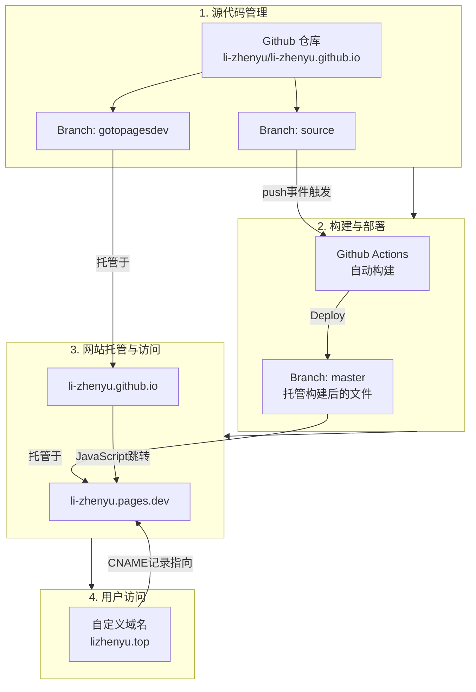

# 关于

## 关于我

李振宇，山东人。不想考公。最近觉得有时用网名不怎么方便，现已实名上网。

## 关于网站

网站使用 Docusaurus 构建。这个网站的最初目的：为了放置一个民法总则教程（现名《奶龙都能看懂的民法总则手册》）。

网站的架构：

[lizhenyu.top](https://lizhenyu.top)这个域名，我还在考虑要不要续费。[li-zhenyu.pages.dev](https://li-zhenyu.pages.dev)是免费的，会长期使用。但是国内访问可能不太稳定，SEO 效果也不怎么样。

因此，如果 lizhenyu.top 挂掉了，读者可以考虑看一下 li-zhenyu.pages.dev，如果也挂掉了，可以设法看一下我的[Github Repo](https://github.com/li-zhenyu/li-zhenyu.github.io)。[我的邮箱](mailto:lizhenyu66666666@outlook.com)长期使用，欢迎您将网站无法访问的情况通过 Github Issues 或者邮箱向我反馈。

## 版权声明

本版权声明条款的文本本身不受著作权限制，任何人可自由使用、复制或修改。

版权声明摘要：作者保留版权，但许可任何人规范无偿地转载和引用。

1. 本网站下发布的内容，如果未特别标注为转载，均为原创。
2. 网站内容的著作权受《中华人民共和国著作权法》及《伯尔尼公约》保护。
3. 作者保留《中华人民共和国著作权法》（2020 年）第十条规定的各项著作权，但另有声明的除外。
4. 作者授权任何人以无偿方式全文或部分转载、引用本网站一切内容，但必须以规范的方式转载或引用。
5. 本声明所言“规范”，是指：
   1. 此项转载或引用必须显著地在正文中向读者说明为转载或引用，不得诱导读者认为此转载的内容为转载者原创；
   2. 此项转载或引用必须显著地在正文中向读者说明其内容的著作权人为本站作者所享有；
   3. 此项转载或引用不得对内容做出修改或者摘录汇编成新文章；
   4. 以翻译方式转载的，应当注明获取原作的方式，或者直接附上原作。
6. 本声明所言“无偿”，是指：
   1. 此项转载不得以纸质出版方式发行，但转载者能证明其转载、出版、发行为无偿的除外；
   2. 此项转载不得以限制仅能被付费者、充值会员或在注册需要缴纳费用的论坛的成员获取；
   3. 此项转载不得启用打赏，但仅引用网站内容的个别词句，引用内容不超过 200 字且在正文占比不超过 10% 的除外，此项引用，不得以在一篇或多篇作品中分散引用以变相转载全文；
   4. 此项转载不得以任何方式作为营利性质的教育培训课程、在线视听作品和广告引流；
   5. 此项转载不得被需要付费使用或者仅限特定人可以使用的数据库产品收录；
   6. 网站内容不得用于商用 API 调用、商用应用程序开发和商用 AI 模型训练；
   7. 此项转载不得以与以上方式近似的方式和目的作出。
7. 如希望以其他方式转载、修改、发布，需要征得作者同意后方可为之，敬请您通过邮箱与本站作者联系。邮件通常会在 7 日内回复。
8. 作者有能力和意愿以法律等途径对其著作权加以保护。
9. 著作权争议适用中华人民共和国法律，由中华人民共和国管辖。
10. 本声明对于本站的各页面源代码一并适用，但不包括本站使用的开源框架等第三方源代码。