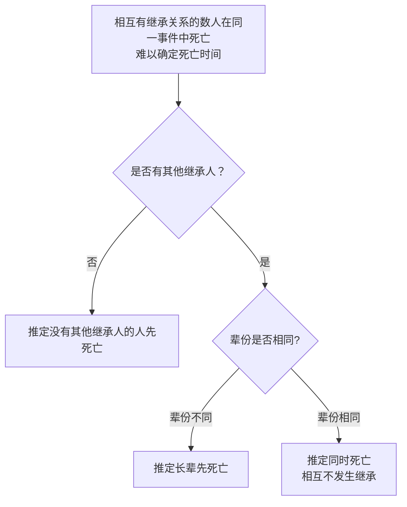
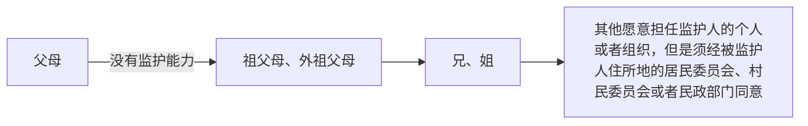
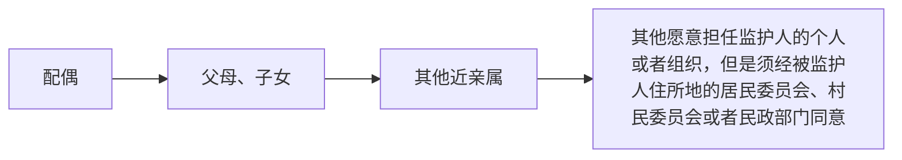

<head><title>自然人 | 民法总则手册 | 李振宇</title></head>

如【2】所言，民事主体包括自然人、法人和非法人组织。本教程尊重《民法典·总则编》的体系安排，分为三章分别讲解。

:::tip
《民法典·总则编》对自然人的规定，围绕**民事权利能力**和**民事行为能力**，针对作为民事主体享有权利承担义务以及实施民事法律行为的资格而展开。人格权、婚姻家庭、继承问题，虽然也具有人身属性，却专门成编规定，而不在总则编的自然人一章加以展开。
:::

## 民事权利能力[^民事权利能力为什么叫民事权利能力]

[^民事权利能力为什么叫民事权利能力]: 民事权利能力之所以叫做民事权利能力，是因为法律将民事权利能力称为民事权利能力。如果你不知道这个脚注为什么会出现在这里——恭喜你，你是这个手册的目标读者。

**民事权利能力**，是指作为民事主体可以**享受民事权利、承担民事义务**的资格。

`自然人从出生时起到死亡时止，具有民事权利能力，依法享有民事权利，承担民事义务。【13】`所以，死人、动物、机器人不是自然人，不能以【13】认为享有民事权利能力。法人、非法人组织、胎儿的权利能力，留待以后详细展开。

`自然人的民事权利能力一律平等【14】`，所以，民事权利能力只分有无，不分大小。

:::info[劳动权利能力]

劳动权利能力是劳动法学领域的概念，以下介绍可能有助于我们理解权利能力的平等性。在民法总则的学习中，不必过于关注这个概念本身。

在劳动法学领域有“劳动权利能力”的概念，但劳动相关立法无此概念。有观点认为：“作为主体资格的劳动者，必须具备一定的劳动权利能力和劳动行为能力。”“劳动权利能力和劳动行为能力不可分割。”“就业年龄是衡量劳动权利能力和劳动行为能力的要素。”[^1]

[^1]: 《劳动与社会保障法学》编写组编：《劳动与社会保障法学》（第二版），高等教育出版社版，第 30 页。

这一系列观点将权利能力和行为能力混同，逻辑上站不住脚。比如劳动年龄应该只是行为能力的限定要素，而权利能力具有固有的平等性。法律上承担雇佣童工责任的主体是雇主而非童工。这种混同，不利于保护权利，也违反了宪法的原则和精神。【宪法 42】规定：`中华人民共和国公民有劳动的权利和义务。`

【最高人民法院关于审理劳动争议案件适用法律问题的解释（一） 41】规定：`劳动合同被确认为无效，劳动者已付出劳动的，用人单位应当按照劳动合同法第二十八条、第四十六条、第四十七条的规定向劳动者支付劳动报酬和经济补偿。`这说明，报酬请求权的来源不限于法律行为，事实行为可以作为报酬请求权的来源。由此可见，承认劳动权利能力和劳动行为能力的可分性，具有现实和法律上的意义。

事实上，这本书还认为，劳动权包括：就业权、劳动报酬权、休息权、劳动安全卫生权、提请劳动争议处理权等。[^2] 那么，一个被非法雇佣的童工，因为没有达到就业年龄，被认定为无劳动权利能力，即不能享有劳动权和承担劳动义务，那么他的非法雇主即可随意而无需付出代价地解雇他、拖欠他的报酬、禁止他休息、将他置于危险肮脏的环境中，劳动争议解决机关也可以拒绝处理他提请的劳动争议。

[^2]: 《劳动与社会保障法学》编写组编：《劳动与社会保障法学》（第二版），高等教育出版社版，第 35 页。

如果认为公民的劳动权利能力一律平等，而行为能力有区分，就像民法认为的那样，则以上问题，迎刃而解。如果坚持将两个混作“不可分割”的整体，则必须将劳动者的报酬权、休息权、卫生安全权等大部分权利排斥在劳动权的概念外，劳动权也就沦为空壳子了。由此可见，法律见解或许可以欠缺逻辑**或**经验，但不能欠缺逻辑**和**经验。

:::

确定出生时间和死亡时间，遵循的顺序是【15】：

1. 其他证据足以推翻以下各项的，以该证据证明的时间为准
2. 以出生证明、死亡证明为准
3. 没有出生证明、死亡证明的，以户籍登记或者其他有效身份登记记载的时间为准

胎儿虽然没有出生，不能独立存活，但是也是有生命的个体。【16】规定，`涉及遗产继承、接受赠与等胎儿利益保护的，胎儿视为具有民事权利能力。但是，胎儿娩出时为死体的，其民事权利能力自始不存在。`

:::tip[拟制]
【16】的规定运用了拟制的方法。拟制就是把不同的事实看作相同的事实，在此基础上，当然适用相同的法律规范。

“娩出时不是死体的胎儿”明明还没有出生，却被“视为有民事权利能力，这样的构造就是拟制。
:::

:::tip[关于出生和死亡的标准]
【15】虽然规定了出生证明等证据的位阶，但并未规定确切的出生和死亡的标准。

:::note[举例：关于出生和死亡的标准]
比如某个其他证据足以证明“脑死亡的时间为 13:00”，而死亡证明显示“心肺死亡的时间为 14:00”，则不能以【15】得出排除“死亡时间为 14:00”的结论。

但是，如果死亡证明显示“死亡时间为 14:00”，而某个其他证据证明“死者于 13:00 已经火化”，则当然可以根据【15】推翻死亡证明。
:::

:::info[胎儿娩出的确切标准]

胎儿娩出的确切标准存在争议。

“胎儿的娩出”到底是指什么事实呢？是一部分露出母体，还是全部露出母体，还是产生独立呼吸才算做娩出，理论上有争议，个案中有一定的意义。

在国际经济法领域，Incoterms 2000 对 FOB 等贸易术语规定为，货物在越过船舷后就交付了。但是实践中如何认定船舷，成为了说不清道不明的难题。因此，Incoterms 2010 将风险转移界限改为货物放在船上才能交付。

基于相似的考量因素，不妨认为“一部露出”“全部露出”这些基于母体的边界（类似于“船舷”，即船体的边界）的判断标准不具有实用的价值。而“独立呼吸”又把“娩出”和“为活体”作为同一个事实来认定，似乎不符合【16】的文字表述。

最后，分娩有包括剖宫产、早产等各种不同形式，采用单一的标准，也无法全面概括。比如，如果认为剖宫产中的母体边界=顺产中的母体边界，则“露出说”就是“双标”的判断依据。在比如，在早产情形下，“独立呼吸说”的解释尤其不符合“娩出”的字面含义。因此，不妨遵循波特·斯图尔特（美）那句名言：“I know it when I see it.”从而认为【16】的要件需要结合个案，权衡利益来具体适用。

:::

:::info[胎儿的定义]

法律没有规定胎儿的定义。

胎儿自何时形成？子宫内的受精卵、胚胎以及人工体外结合形成的受精卵、胚胎，是否属于胎儿？这个问题涉及到这些问题涉及法律上“胎儿”术语的定义。这个问题与继承、侵权等问题有关。

理论上有不同的见解，多数意见认为自受精卵到出生前均为胎儿，这个解释立足于法律保护非独立而有生命个体的立法目的，但是理论上的多数意见并不具有任何意义上的强制性。

（2024）苏 0812 行初 468 号判决书认为，胚胎不是胎儿，但参考适用了【16】的规范，认为其符合“娩出活体”条件，则溯及地获得权利能力。暂未找到其他的有关判决。

:::

:::info[死亡的确切标准]

法律没有明确规定死亡的确切标准。

死亡的标准有多种观点：主要有脑死亡标准、心肺死亡标准。实践中两个标准均有采用（裁判文书略，欢迎读者投稿）。医学上一般认为以脑死亡为标准，但法律业内不都赞同。因为法律没有明确规定，所以强行择一的解释，说服力不强。

朱庆育认为：“如果将关注点集中于维护人的主体地位上，那么，判断是否死亡，宜以各种生命迹象中最后消逝的时间为准。”[^zqy]这种学说作为立法建议[^sugg]是合理的，但在现状下，运用时有局限性（见下文举例）。

[^zqy]: 朱庆育：《民法总论》（第二版），北京大学出版社版，第 389 页。
[^sugg]: 如果认为有必要对死亡时间加以明确的、唯一的、排他的规定的话。

不妨通过目的解释，在个案中权衡利益后，采纳最有说服力的死亡标准作为策略。举例如下：

- 死者为被保险人（如（2022）冀 0803 民初 899 号）或刑事案件的被害人时，采用有利于认定因果关系的死亡标准（通常是早达成的标准）
  - 这是“最后消逝说”的直接反例
- 是否救治死者对主张救治的人有利害关系的，采用对主张救治的人有利的标准
- 死者与其主要赡养人死亡时间接近且可以查明的，采用有利主要赡养人的继承人继承死者的遗产的死亡标准（通常是早达成的标准）
- 死亡时间对死者领取退休金有影响的，采用有利于死者领取退休金的标准等。

法律不规定，学说无共识，策略须大胆，手脚别自缚。

:::

:::info[无法查明多人死亡时间的推定]

这是继承法的内容，在民法总则阶段，不要求掌握。

> 【1121】继承从被继承人死亡时开始。

> 相互有继承关系的数人在同一事件中死亡，难以确定死亡时间的，推定没有其他继承人的人先死亡。都有其他继承人，辈份不同的，推定长辈先死亡；辈份相同的，推定同时死亡，相互不发生继承。

:::

<!-- 2025/10/27更新，修改为新的方法 -->

## 民事行为能力

**民事行为能力**，是指民事主体以其民事法律行为参与民事法律关系，取得民事权利，承担民事义务的能力。

:::tip[理解民事权利能力和民事行为能力的区别]
民事权利能力是人与非人的区别，民事行为能力是人与人的区别。有民事权利能力，则加以保护；有民事行为能力，则委以信任。
:::

由上述概念可以推知，不具有完全民事行为能力的人，不能独立行使部分或者全部民事法律行为，而必须通过法定代理人为其代理实施民事法律行为。`无民事行为能力人、限制民事行为能力人的监护人是其法定代理人。【23】`

首先，`十八周岁以上的自然人为成年人。不满十八周岁的自然人为未成年人。【17】`然后根据【18】到【22】的规定，将民事行为能力的区分标准列表如下：

|类型 | 年龄 | 精神状态 |
|----|--|-------|
|完全民事行为能力 | 成年人、十六周岁以上的未成年人且以自己的劳动收入为主要生活来源（被视为）（）（【18】）| 完全辨认自己的行为 |
|限制民事行为能力 | 八周岁以上的未成年人（【19】）| 不能完全辨认自己行为的成年人（【22】）|
|无民事行为能力 | 不满八周岁的人（【20】）| 不能辨认自己行为的成年人、不能辨认自己行为的八周岁以上未成年人（【21】）|

不能随便认为某个人“不能或者不能完全辨认自己的行为”，如果这样做，就意味着可以随便剥夺其民事行为能力，使其不能独立实施民事法律行为。因此，【24】限定了认定成年人不具有完全民事行为能力的程序和资格，相应地，也规定了恢复民事行为能力的程序和标准：

> 【24】不能辨认或者不能完全辨认自己行为的成年人，其利害关系人或者有关组织，可以向人民法院申请认定该成年人为无民事行为能力人或者限制民事行为能力人。
> 
> 被人民法院认定为无民事行为能力人或者限制民事行为能力人的，经本人、利害关系人或者有关组织申请，人民法院可以根据其智力、精神健康恢复的状况，认定该成年人恢复为限制民事行为能力人或者完全民事行为能力人。
>
> 本条规定的有关组织包括：居民委员会、村民委员会、学校、医疗机构、妇女联合会、残疾人联合会、依法设立的老年人组织、民政部门等。 

认定公民无民事行为能力、限制民事行为能力案件的具体程序，规定在《民事诉讼法》中。这里从简省略。

## 住所

`自然人以户籍登记或者其他有效身份登记记载的居所为住所；经常居所与住所不一致的，经常居所视为住所。【25】`所谓经常居住地，【民诉法解释 4】规定：`公民的经常居住地是指公民离开住所地至起诉时已连续居住一年以上的地方，但公民住院就医的地方除外。`

## 监护

### 监护能力

担任监护人需要具有监护能力。`人民法院认定自然人的监护能力，应当根据其年龄、身心健康状况、经济条件等因素确定；认定有关组织的监护能力，应当根据其资质、信用、财产状况等因素确定。【总则编解释 6】`

### 监护的发生

一旦一个不具有完全民事行为能力的自然人没有监护人，应该按照以下顺序确定其监护人。

#### 意定监护

`具有完全民事行为能力的成年人，可以与其近亲属、其他愿意担任监护人的个人或者组织事先协商，以书面形式确定自己的监护人，在自己丧失或者部分丧失民事行为能力时，由该监护人履行监护职责。【33】`这种监护方式被称作意定监护。

这一协议必须是书面的。

这一协议，双方都享有任意解除权，直到约定的监护开始，这是因为：

>【总则编解释 11】具有完全民事行为能力的成年人与他人依据民法典第三十三条的规定订立书面协议事先确定自己的监护人后，协议的任何一方在该成年人丧失或者部分丧失民事行为能力前请求解除协议的，人民法院依法予以支持。该成年人丧失或者部分丧失民事行为能力后，协议确定的监护人无正当理由请求解除协议的，人民法院不予支持。

#### 遗嘱监护

遗嘱监护是指**未成年人**的**父母**如果**担任其监护人**，就可以在**遗嘱**中指定其监护人（【29】）。

在两种情况下，遗嘱监护会落空，也就是说，即使符合上面的条件，也要跳过遗嘱监护的考察：

1. 遗嘱生效时被指定的人不同意担任监护人；
2. 父母中有一方在遗嘱生效时有监护能力。

#### 法定监护

未成年人的法定监护顺序如【27】所规定：

成年人的法定监护顺序如【28】所规定：

#### 协议监护

对于协议监护，法律规定：`依法具有监护资格的人之间可以协议确定监护人。协议确定监护人应当尊重被监护人的真实意愿。【30】`

【总则编解释 8】规定了协议监护的细则。按照其细则，以下协议监护是可行的：

1. 约定在未成年人父母丧失监护能力时由该具有监护资格的人担任监护人；
2. 依法具有监护资格的人之间约定，突破法定监护顺序，而单独或共同担任监护人，但不能突破未成年人父母的首位；

以下协议监护是不可行的：

1. 未成年人父母与其他人协议免除具有监护能力的父母的监护职责的。

#### 指定监护

> 【31-1】对监护人的确定有争议的，由被监护人住所地的居民委员会、村民委员会或者民政部门指定监护人，有关当事人对指定不服的，可以向人民法院申请指定监护人；有关当事人也可以直接向人民法院申请指定监护人。

这里指定的监护人，按照【总则编解释9-2】，原则上是一人，更有利于被监护人的，也可以是数人。这里的“对指定不服”，按照【总则编解释 10】，应该在 30 日内提出，否则按照变更监护人处理。

> 【31-2】居民委员会、村民委员会、民政部门或者人民法院应当尊重被监护人的真实意愿，按照最有利于被监护人的原则在依法具有监护资格的人中指定监护人。

这里所说的“尊重意愿”“最有利于”，【总则编解释 9-1】各项详述考量的因素如下：

1. 与被监护人生活、情感联系的密切程度；
2. 依法具有监护资格的人的监护顺序；
3. 是否有不利于履行监护职责的违法犯罪等情形；
4. 依法具有监护资格的人的监护能力、意愿、品行等。

> 【31-3】依据本条第一款规定指定监护人前，被监护人的人身权利、财产权利以及其他合法权益处于无人保护状态的，由被监护人住所地的居民委员会、村民委员会、法律规定的有关组织或者民政部门担任临时监护人。

> 【31-4】监护人被指定后，不得擅自变更；擅自变更的，不免除被指定的监护人的责任。 

也就是说，变更前后的人都得承担监护的责任。

#### 机关监护

> 【32】没有依法具有监护资格的人的，监护人由民政部门担任，也可以由具备履行监护职责条件的被监护人住所地的居民委员会、村民委员会担任。 

### 监护的终止

<!--一眼就可以看出，可以分为“一时性终止”和“永久性终止”。YDX也是如此分类的。但是没有必要，庸人自扰而已。-->

以下情形发生，则监护关系终止（【39】）：

1. 被监护人取得或者恢复完全民事行为能力；
2. 监护人丧失监护能力；
3. 被监护人或者监护人死亡；
4. 人民法院认定监护关系终止的其他情形。 

其中，“其他情形”包括监护被撤销。

### 监护的撤销与恢复

#### 有权申请撤销监护的人

有权申请撤销监护的人，包括：其他依法具有监护资格的人、居民委员会、村民委员会、学校、医疗机构、妇女联合会、残疾人联合会、未成年人保护组织、依法设立的老年人组织、民政部门等（【36-2】）。其中，民政部门在其他人不申请时，应当承担申请的义务（【36-3】）

#### 监护撤销的条件

监护人满足以下情形之一：

1. 实施严重损害被监护人身心健康的行为；
2. 怠于履行监护职责，或者无法履行监护职责且拒绝将监护职责部分或者全部委托给他人，导致被监护人处于危困状态；
3. 实施严重侵害被监护人合法权益的其他行为。

#### 被撤销的监护恢复的条件

同时满足【38】规定的以下条件，人民法院**可以视情况**恢复其监护资格，同时终止因监护被撤销而发生的监护关系：

1. 其监护被撤销；
2. 其身份是被监护人的**父母或子女**；
3. 未曾对被监护人实施故意犯罪；
4. 确有悔改表现；
5. 经其申请；
6. 不违背监护人真实意愿。

### 监护职责

监护人的职责，值得注意的部分，用粗体标注在下列法律条文中：

> 【34】监护人的职责是**代理被监护人实施民事法律行为，保护被监护人的人身权利、财产权利以及其他合法权益等**。
> 
> 监护人依法履行监护职责产生的权利，受法律保护。
> 
> 监护人不履行监护职责或者侵害被监护人合法权益的，应当承担法律责任。
> 
> 因发生突发事件等紧急情况，监护人暂时无法履行监护职责，被监护人的生活处于无人照料状态的，被监护人住所地的居民委员会、村民委员会或者民政部门应当为被监护人安排必要的临时生活照料措施。

> 【35】监护人应当按照最有利于被监护人的原则履行监护职责。监护人**除为维护被监护人利益外，不得处分被监护人的财产**。
> 
> 未成年人的监护人履行监护职责，在作出与被监护人利益有关的决定时，应当根据被监护人的年龄和智力状况，**尊重被监护人的真实意愿**。

> 成年人的监护人履行监护职责，应当最大程度地**尊重被监护人的真实意愿**，保障并协助被监护人实施与其智力、精神健康状况相适应的民事法律行为。对被监护人有能力独立处理的事务，监护人不得干涉。 

此外，监护人还有在自己无法履行监护职责时委托他人代为看护的义务。（见上文“监护撤销的条件”一节）但是，`监护人因患病、外出务工等原因在一定期限内不能完全履行监护职责，将全部或者部分监护职责委托给他人，当事人主张受托人因此成为监护人的，人民法院不予支持。【总则编解释 13】`

<!--可选补充：YDX 149-129 委托照护-->

此外，可以认为，担当被监护人的法定代理人，是监护的职责之一。

## 宣告失踪和宣告死亡

宣告失踪和宣告死亡都旨在解决的问题是：一旦自然人下落不明，那么与其相关的法律关系就被冻结了，并且这种冻结状态不利于利害关系人的权利的实现。

比如：某人欠了钱却在野外迷路了，或者某个人在战争中与其配偶失散了，此时其财产关系（债）或身份关系（婚姻）就止步不前。

因此，宣告失踪和宣告死亡制度目的**并非剥夺或限制被宣告人的权利本身**，而是促进利害关系人的权利的实现。因此，被宣告的人可以申请撤销宣告；因此，被宣告死亡的人仍然可以实施有效的民事法律行为。

其中，宣告失踪解决的是**财产关系**被冻结的状态，主要手段是安排财产代管人代为管理失踪人的财产；宣告死亡不仅解决**财产关系**的冻结状态，而且解决**身份关系**的冻结状态。

因此，宣告失踪制度和宣告死亡制度中的“**利害关系人**”，其**范围**有所不同。

逐一讲解这两个制度的具体规定如下：

<!--宣告制度，放在一起加以讲解，而不是按照“宣告死亡是死亡的一种”的逻辑来安排。-->

### 宣告失踪[^宣告失踪的体例安排]

[^宣告失踪的体例安排]: `下落不明是指公民离开最后居住地后没有音讯的状况。对于在台湾或者在国外，无法正常通讯联系的，不得以下落不明宣告死亡。【民通意见 26】`，这条规定已经删除。下落不明按一般理解，与住所毫无关系。因此，朱庆育《民法总论》（第二版）、张俊浩《民法学原理》（2024年修订版）等经典教材的安排，其基础不复存在。

#### 宣告失踪的条件

> 【40】自然人下落不明满**二年**的，[利害关系人](#宣告失踪的利害关系人)可以向人民法院申请宣告该自然人为失踪人。

> 【41】自然人下落不明的时间自其失去音讯之日起计算。战争期间下落不明的，下落不明的时间自战争结束之日或者有关机关确定的下落不明之日起计算。

#### 宣告失踪的利害关系人

> 【总则编解释 14】人民法院审理宣告失踪案件时，下列人员应当认定为民法典第四十条规定的利害关系人：
> 
> （一）被申请人的**近亲属**；
> 
> （二）依据民法典**第一千一百二十八条**、**第一千一百二十九条**规定对被申请人有继承权的亲属；
> 
> （三）债权人、债务人、合伙人等与被申请人有民事权利义务关系的民事主体，但是不申请宣告失踪不影响其权利行使、义务履行的除外。

> 【1045-2】配偶、父母、子女、兄弟姐妹、祖父母、外祖父母、孙子女、外孙子女为**近亲属**。

> 【1128】被继承人的子女**先于**被继承人死亡的，由被继承人的子女的直系晚辈血亲**代位**继承。
> 
> 被继承人的兄弟姐妹**先于**被继承人死亡的，由被继承人的兄弟姐妹的子女**代位**继承。
> 
> 代位继承人一般只能继承被代位继承人有权继承的遗产份额。

> 【1129】**丧偶**儿媳对公婆，丧偶女婿对岳父母，**尽了主要赡养义务**的，作为第一顺序继承人。

#### 宣告失踪的效果

宣告失踪后，要确定财产代管人。`失踪人的财产由其配偶、成年子女、父母或者其他愿意担任财产代管人的人代管。代管有争议，没有前款规定的人，或者前款规定的人无代管能力的，由人民法院指定的人代管。【42】`

财产代管人的职责，包括：`财产代管人应当妥善管理失踪人的财产，维护其财产权益。失踪人所欠税款、债务和应付的其他费用，由财产代管人从失踪人的财产中支付。财产代管人因故意或者重大过失造成失踪人财产损失的，应当承担赔偿责任。【43】`

财产代管人变更：`财产代管人不履行代管职责、侵害失踪人财产权益或者丧失代管能力的，失踪人的利害关系人可以向人民法院申请变更财产代管人。财产代管人有正当理由的，可以向人民法院申请变更财产代管人。人民法院变更财产代管人的，变更后的财产代管人有权请求原财产代管人及时移交有关财产并报告财产代管情况。【44】 `

#### 宣告失踪的撤销

撤销的条件：`失踪人重新出现，经本人或者利害关系人申请，人民法院应当撤销失踪宣告。【45-1】`

撤销的效果：`失踪人重新出现，有权请求财产代管人及时移交有关财产并报告财产代管情况。【45-2】`

### 宣告死亡

#### 宣告死亡的条件

> 【46】自然人有下列情形之一的，[利害关系人](#宣告死亡的利害关系人)可以向人民法院申请宣告该自然人死亡：
> 
> （一）下落不明满**四年**；
> 
> （二）因**意外**事件，下落不明满**二年**。
> 
> 因意外事件下落不明，经有关机关证明该自然人不可能生存的，申请宣告死亡**不受**二年时间的**限制**。

> 【总则编解释 17】自然人在战争期间下落不明的，利害关系人申请宣告死亡的期间适用民法典第四十六条第一款第一项的规定，自**战争结束之日**或者有关机关确定的下落不明之日起计算。

> 【47】对同一自然人，有的利害关系人申请宣告死亡，有的利害关系人申请宣告失踪，符合本法规定的宣告死亡条件的，人民法院应当宣告死亡。 

#### 宣告死亡的利害关系人

> 【总则编解释 16】人民法院审理宣告死亡案件时，被申请人的配偶、父母、子女，以及依据民法典第一千一百二十九条规定对被申请人有继承权的亲属应当认定为民法典第四十六条规定的利害关系人。
> 
> 符合下列情形之一的，被申请人的其他近亲属，以及依据民法典第一千一百二十八条规定对被申请人有继承权的亲属应当认定为民法典第四十六条规定的利害关系人：
> 
> （一）被申请人的配偶、父母、子女均已死亡或者下落不明的；
> 
> （二）不申请宣告死亡不能保护其相应合法权益的。
> 
> 被申请人的债权人、债务人、合伙人等民事主体不能认定为民法典第四十六条规定的利害关系人，但是不申请宣告死亡不能保护其相应合法权益的除外。

#### 宣告死亡的时间

> 【48】被宣告死亡的人，人民法院宣告死亡的判决作出之日视为其死亡的日期；因意外事件下落不明宣告死亡的，意外事件发生之日视为其死亡的日期。 

#### 宣告死亡的效果

> 【49】自然人被宣告死亡但是并未死亡的，不影响该自然人在被宣告死亡期间实施的民事法律行为的效力。 

> 【51】被宣告死亡的人的婚姻关系，自死亡宣告之日起消除。……

#### 宣告死亡的撤销

##### 撤销宣告死亡的条件

> 【50】被宣告死亡的人重新出现，经**本人**或者利害关系人申请，人民法院应当撤销死亡宣告。

##### 撤销的效果

> 【51】……死亡宣告被撤销的，婚姻关系自撤销死亡宣告之日起自行恢复。但是，其配偶再婚或者向婚姻登记机关书面声明不愿意恢复的除外。

> 【52】被宣告死亡的人在被宣告死亡期间，其子女被他人依法收养的，在死亡宣告被撤销后，不得以未经本人同意为由主张收养行为无效。

> 【53】被撤销死亡宣告的人有权请求依照本法第六编取得其财产的民事主体返还财产；无法返还的，应当给予适当补偿。
> 
> 利害关系人隐瞒真实情况，致使他人被宣告死亡而取得其财产的，除应当返还财产外，还应当对由此造成的损失承担赔偿责任。 

### 对比：宣告失踪和宣告死亡

|项目|宣告失踪|宣告死亡|
|----|--------|--------|
|利害关系人|近亲属、代位继承人（【1128】）、**有法定继承权**的儿媳或女婿（【1129】）；因宣告而权利义务受影响的债权人、债务人、合伙人等|配偶、父母、子女；前三者均死亡或下落不明时的其他近亲属；不宣告死亡不能保护相应合法权益的其他近亲属、债权人、债务人、合伙人等|
|效果|财产代管|类似死亡的一系列法律效果（继承、婚姻的消除、子女可以被收养）|
|效果的属性|财产性|人身性和财产性|

## 个体工商户和农村承包经营户

> 【54】自然人从事工商业经营，经依法登记，为个体工商户。个体工商户可以起字号。

> 【55】农村集体经济组织的成员，依法取得农村土地承包经营权，从事家庭承包经营的，为农村承包经营户。

> 【56】个体工商户的债务，个人经营的，以个人财产承担；家庭经营的，以家庭财产承担；无法区分的，以家庭财产承担。
> 
> 农村承包经营户的债务，以从事农村土地承包经营的农户财产承担；事实上由农户部分成员经营的，以该部分成员的财产承担。