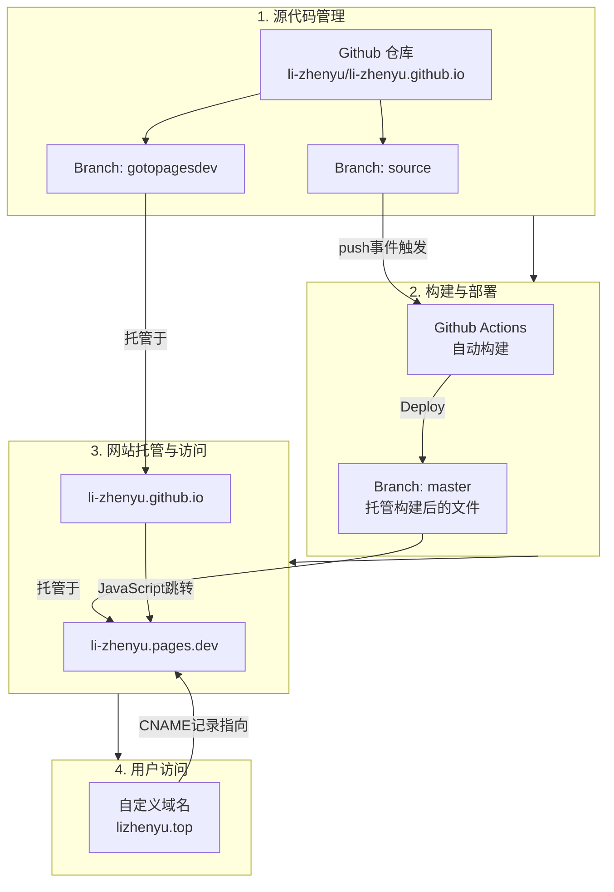

## 关于我

李振宇，山东人。不想考公。最近觉得有时用网名不怎么方便，现已实名上网。

## 关于网站

[lizhenyu.top](https://lizhenyu.top)这个域名，我还在考虑要不要续费。[li-zhenyu.pages.dev](https://li-zhenyu.pages.dev)是免费的，会长期使用。但是国内访问可能不太稳定，SEO效果也不怎么样。

因此，如果lizhenyu.top挂掉了，读者可以考虑看一下li-zhenyu.pages.dev，如果也挂掉了，可以设法看一下我的[Github Repo](https://github.com/li-zhenyu/li-zhenyu.github.io)。[我的邮箱](mailto:lizhenyu66666666@outlook.com)长期使用，欢迎您将网站无法访问的情况通过Github Issues或者邮箱向我反馈。