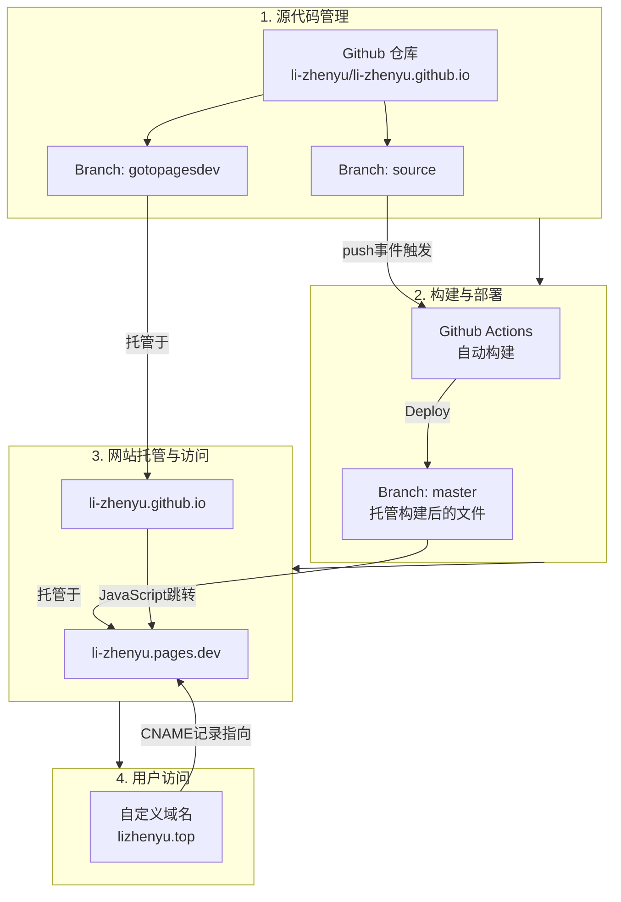

# 关于

## 关于我

李振宇，山东人。不想考公。最近觉得有时用网名不怎么方便，现已实名上网。

## 关于网站

这个网站的最初目的：为了放置一个民法总则教程（现名《奶龙都能看懂的民法总则手册》）。

网站的架构：

[lizhenyu.top](https://lizhenyu.top)这个域名，我还在考虑要不要续费。[li-zhenyu.pages.dev](https://li-zhenyu.pages.dev)是免费的，会长期使用。但是国内访问可能不太稳定，SEO 效果也不怎么样。

因此，如果 lizhenyu.top 挂掉了，读者可以考虑看一下 li-zhenyu.pages.dev，如果也挂掉了，可以设法看一下我的[Github Repo](https://github.com/li-zhenyu/li-zhenyu.github.io)。[我的邮箱](mailto:lizhenyu66666666@outlook.com)长期使用，欢迎您将网站无法访问的情况通过 Github Issues 或者邮箱向我反馈。

## 许可协议

作者通过许可协议，确认其享有本网站下内容的著作权，并发出要约，将部分权利向您许可。本许可协议条款的文本本身不受著作权限制，您可以自由使用、复制或修改，但作者不对该声明提供任何担保。对本网站内容的使用应该在您接受本协议时方被许可。您可以随时选择或变更您是否接受本协议。

### 摘要

**作者保留著作权，但许可您：非以商业方式在署名的前提下不加修改地加以转载、署名引用、仅为前述转载和引用而翻译。**

商业使用必须获得特别许可。

### 定义

《中华人民共和国著作权法》，是指：

1. 2020 年修正的版本。

网站内容，是指，除作者另有声明外的：
   
1. 在网站内所储存且由作者创作的符合《中华人民共和国著作权法》第三条界定的“作品”；
2. 网站的截图和快照；
3. 构建网站所需的源代码，但开源框架等第三方提供的源代码除外。

转载，是指，在不修改或改编网站内容的前提下：

1. 将网站内容另行公开或者在一定范围内发布，或者；
2. 制作反映网站内容的作品，并进行发布，或者；
3. 其他由《中华人民共和国著作权法》第十条第一款第五项到第十三项所规定的权利的行使。

引用，是指：

1. 将网站内容原封不动地混入您的作品。作为引用，您必须：
   1. 不得在一篇或数篇作品分散引用以变相转载全文；
   2. 不得以引用的网站内容作为您的作品的主要部分；
   3. 以明确的记号注明其有别于您亲自创作的部分。

署名，是指：

1. 显著地在说明为转载或引用，不得诱导读者认为网站内容为您所原创；
2. 显著地说明网站内容来自作者，但您无需写明“著作权”字样；
3. 不得明示或暗示地诱导读者认为网站内容的著作权不受保护；
4. 在翻译作品上随同注明获取原作的方式，或者直接附上原作。

商业方式，是指：

1. 以纸质方式发行，但能证明其转载、出版、发行等环节均为无偿的除外，或者；
2. 限制仅能被付费者、充值会员、在注册需要缴纳费用的论坛的成员或其他付费取得资格的读者获取，或者；
3. 启用打赏，或者；
4. 以任何方式作为营利性质的教育培训课程、在线视听作品和广告引流的内容，或者；
5. 收录于需要付费使用或者仅限特定人可以使用的数据库产品，或者；
6. 用于商用 API 调用、商用应用程序开发和商用 AI 模型训练，或者；
7. 其他与上列方式本质和目的一致的方式，即营利方式，但不要求实际上得到利润。

作者，是指：

1. 网站内容的著作权人。

您，是指：

1. 接受本许可协议的自然人、法人或非法人组织。

### 许可范围

作者以免费、不可转许可、非独占的条件向您许可：

1. 转载网站内容的全部或部分；
2. 引用网站内容的全部或部分；
3. 翻译网站内容的全部或部分；
4. 为以上转载、引用、翻译，对网站内容进行技术上的而非内容上的变动。

法律另有强制性规定的，从其规定。

作者未向您许可的著作权利，仍然依据《中华人民共和国著作权法》第十一条，属于作者专享。

### 许可条件

若您对网站内容加以引用，您必须：

1. 署名

若您对网站内容加以转载，您必须：

1. 署名；
2. 非以商业方式作出。

若您对网站内容加以翻译，您必须：

1. 署名；
2. 非以商业方式作出；
3. 将您的翻译版本仅用于接受本许可协议前提下的引用、转载与再次翻译。

### 免责条款

作者不对网站内容提供任何形式任何范围的担保，具体而言：

1. 作者不会因向您许可网站内容而向您承担任何赔偿责任，包括但不限于直接的、特殊的、间接的、附随的、连带的、惩罚性的、警告性的、故意的、过失的、严格责任的，或其他的损失、成本、费用或损害，但法律另有强制性规定的除外；
2. 作者不会因向您许可网站内容而向您承诺网站内容无品质或权利上的瑕疵，但法律另有强制性规定的除外。

作者对您擅自超越许可范围的行为不承担任何责任。

### 附加条款

您超越本协议许可范围而对网站内容的权利的行使，必须经过作者单独特别许可方可为之，请通过本站提供的联系方式或其他方式联系作者，未获许可而擅自为之，则作者将追究您的责任。

与网站内容的著作权相关的争议，适用中华人民共和国法律，由中华人民共和国管辖。

协议相关争议由协议履行地或被告住所地法院管辖。协议履行地为作者住所地。

本协议作为一体不可分的要约向您发出，任何变更均不构成承诺。

作者保留随时更新本许可协议的权利，更新后的条款自网站公告之日起生效，但您根据行为作出时的协议获得许可，不受到修改后的协议的影响。

因法律强制性规定或其他不可抗拒的事实导致某些条款的某些要素无法对您适用的，不影响其他条款与许可协议本身的效力。

## 如何引用本站内容

如果您想要引用本站的内容，可以合乎以上许可协议的方式，任意为之。

如果您想要引用本站在某一时刻的固定内容，不随网站的更新而变动[^1]，则建议您可以：

1. 记录本网站在其确切时间点的 git commit 记录，或者；
2. 向 Wayback Machine 等其他工具提交 URL 以保存副本，或者；
3. 如果您不在意内容可靠性的可证明性，则自行通过截图或者拷贝等方式制作副本，或者；
4. 通过任何合乎目的的方式为之。

[^1]: 尽管您不太可能这么做😂。